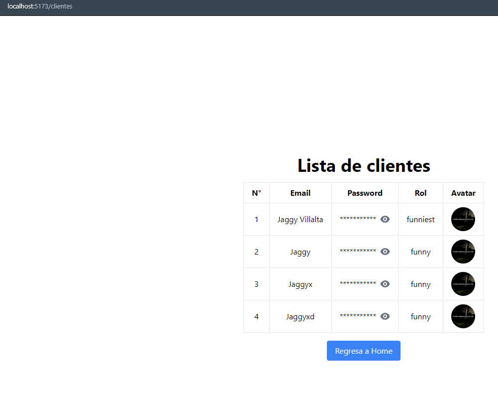
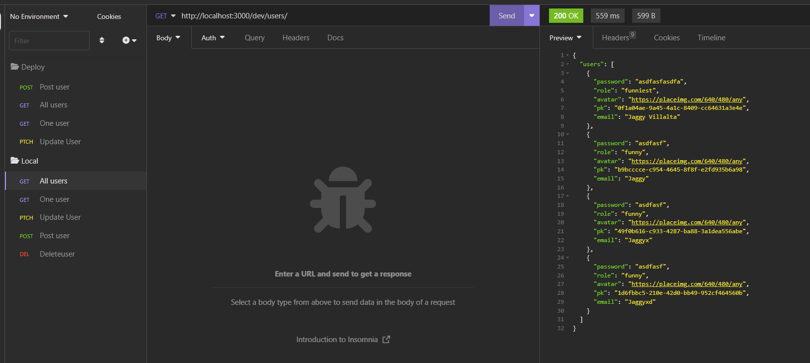

# SERVERLESS AWS FULLSTACK


## Instalaciones necesarias

```bash
    AWS CLI
    NODEJS
    SERVERLESS
```

## Configura su AWS

Con el comando aws configure luego de haber instalado aws CLI

[AWS CLI](https://aws.amazon.com/es/cli/)


## Instala los packsage.json para ambos servicios

```bash
    npm install

```

## USO

Primero en la carpeta de backend se encuentra toda la configuración de serverless.yml

```bash
    serverless.yml

```

### Frontend

En el frontend tenemos el consumo de la API del backend, en este caso se consume la api local al iniciar el servicio back.

```bash
    NPM RUN DEV

```

Pero para correrlo en S3, ya debiste haber creado un bucket el cuál servirá para usarlo en AWS.


Configura el bucket para que reciba el archivo index.html como principal, y dale propiedades y politicas de S3.

Texto referencial de politicas que podria usar:

```bash
            "Principal": "*",
            "Action": [
                "s3:GetObject",
                "s3:PutObject",
                "s3:PutObjectAcl",
                "s3:ListBucket",
                "s3:DeleteObject"
            ],
            "Resource": [
                "arn:aws:s3:::clientes-users-frontend",
                "arn:aws:s3:::clientes-users-frontend/*"
            ]

```

Luego usa un comando de AWS CLI para deployar 
```bash
    aws s3 sync dist/ s3://NOMBRE-DE-SU-BUCKET

```

Recuerda que el dist puede cambiar, sí usaste create-react y al hacer build se genera la carpeta build y no dist 

### Backend

De la misma forma instalas las dependencias
```bash
    NPM INSTALL
```

En este caso luego de ya tener instalado serverless, puedes realizar el comando para ver que todo se haya instalado correctamente

```bash
    sls --help
    serverless --help
```

De ahí te puede aparacer todos los comandos, y sí usaste la configuración de este repositorio tendrás los pluggins correctos para hacer localmente

En local:
```bash
    sls dynamodb install
    sls offline start
```
Primero instalas dynamodb de forma local, y sí todo sucede correctamente puedes iniciar el servidor con offline start.

Prueba la api con inmsonia o alguno de esos clientes rest.

Ahora para hacer deploy, debes tener configurado tu aws cli.

```bash
sls deploy
```

El comando pequeño pero fuerte, crea todos los servicios en aws para que pueda funcionar en la nube.


## 🔗 Links




[Frontend deployed](http://clientes-users-frontend.s3-website-us-east-1.amazonaws.com)

[Backend deployed](https://gyd129goke.execute-api.us-east-1.amazonaws.com/dev/users)

[Video de funcionamiento e imagenes extras](https://drive.google.com/drive/folders/1Y1SF66qderGdZNAAGb9Yc_vvtS4e6tYR?usp=sharing)